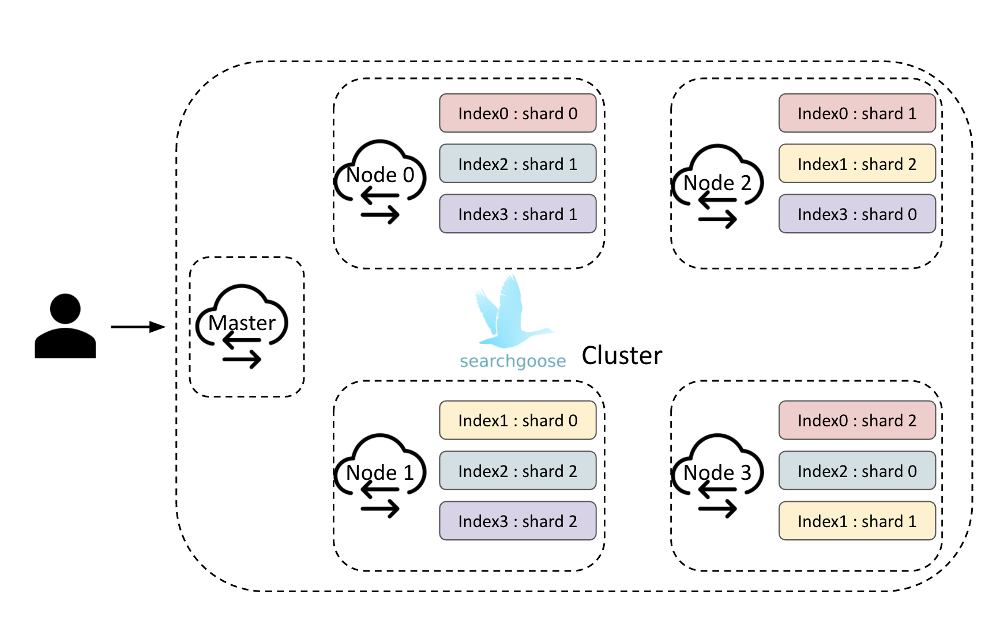
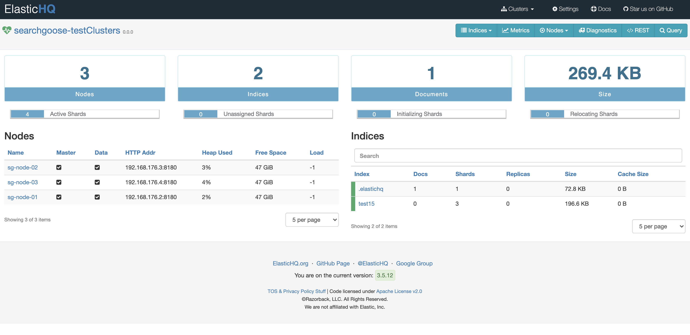

<div align="center">
  <br/>
  
  <br/>
  <br/>
  <p>
    🦢 Simple, distributed, lightweight<br>
    RESTful search engine implementation written in go 🔍
  </p>
  <p>
    <a href="https://gitter.im/searchgoose/community">
      
    </a>
    <a href="https://goreportcard.com/report/github.com/actumn/searchgoose">
      
    </a>
    <a href="https://github.com/actumn/searchgoose/blob/master/LICENSE">
      
    </a>
  </p>
</div>

---
## Introduction
Searchgoose is simple distributed **RESTful search engine** supporting  searching and indexing data. For Study purposes, mostly understanding the implementation details of how [elasticearch](https://github.com/elastic/elasticsearch) is built, focusing on clustering distributed system and supporting full-text search using [bleve](https://github.com/blevesearch/bleve). Searchgoose aims to provide fast and flexible data handling by solving the problems of the existing relational database, which is bothering tasks to search and divide string data. To solve this problem, this project uses a data structure called an **inverted index** that supports fast full-text searches. It also implements raft-like algorithm and quorum-based voting system for discovery and election service in clustering mode.

## Architecture



## REST API
### Cluster API
- [/_nodes](https://www.elastic.co/guide/en/elasticsearch/reference/current/cluster-nodes-info.html)
- [/_nodes/stats](https://www.elastic.co/guide/en/elasticsearch/reference/current/cluster-nodes-stats.html)
- [/_cluster/health](https://www.elastic.co/guide/en/elasticsearch/reference/current/cluster-health.html)
- [/_cluster/state](https://www.elastic.co/guide/en/elasticsearch/reference/current/cluster-state.html)
- [/_cluster/stats](https://www.elastic.co/guide/en/elasticsearch/reference/current/cluster-stats.html)

### Index / Document API
- [/{index}](https://www.elastic.co/guide/en/elasticsearch/reference/current/indices-get-index.html)
- [/{index}/_doc](https://www.elastic.co/guide/en/elasticsearch/reference/current/docs-get.html)
- [/{index}/_search](https://www.elastic.co/guide/en/elasticsearch/reference/current/search-search.html)
- [/{index}/_refresh](https://www.elastic.co/guide/en/elasticsearch/reference/current/indices-refresh.html)

## Build 
### DockerFile
```shell script
$ docker build . --rm --tag searchgoose:latest
```

### Makefile
```shell script
$ make build
```

## Run
### Single mode
```shell script
$ go run main.go -transport.port=8180 -http.port=8080
```
### Clustering mode
```shell script
$ go run main.go -node.name=sg-node-01 -transport.port=8180 -http.port=8080
$ go run main.go -node.name=sg-node-02 -seed_hosts=127.0.0.1:8180 -transport.port=8179 -http.port=8081
$ go run main.go -node.name=sg-node-03 -seed_hosts=127.0.0.1:8180 -transport.port=8181 -http.port=8082
```


## API
To try any of the below queries you can use the above example quries

### Create Index

```
PUT /test15
content-type: application/json

{
  "settings": {
    "number_of_shards": 3
  },
  "mappings": {
    "properties": {
      "field1": {
        "type": "text"
      }
    }
  }
}
```

### Document Index
```
PUT /test15/_doc/4
content-type: application/json

{
  "field1": "test",
  "field2": "test2"
}
```

### Search
```
POST /test15/_search
content-type: application/json

{
  "size": 100,
  "query": {
    "match": {
      "field1": "field test"
    } 
  }
}
```

## Example

The above image describes Searchgoose test application using [Guttenberg-Search](https://github.com/triestpa/Guttenberg-Search). 

## Visualization

The above image describes simplified interface for managing and monitoring Searchgoose clusters by [elasticsearch-HQ](https://github.com/ElasticHQ/elasticsearch-HQ). 
